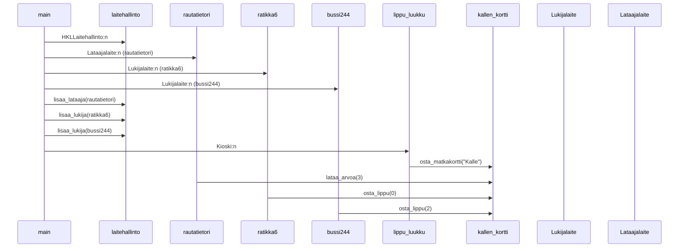

```mermaid
sequenceDiagram
    participant main
    participant laitehallinto
    participant rautatietori
    participant ratikka6
    participant bussi244
    participant lippu_luukku
    participant kallen_kortti
    participant Lukijalaite
    participant Lataajalaite

    main->>laitehallinto: HKLLaitehallinto:n
    main->>rautatietori: Lataajalaite:n (rautatietori)
    main->>ratikka6: Lukijalaite:n (ratikka6)
    main->>bussi244: Lukijalaite:n (bussi244)
    main->>laitehallinto: lisaa_lataaja(rautatietori)
    main->>laitehallinto: lisaa_lukija(ratikka6)
    main->>laitehallinto: lisaa_lukija(bussi244)
    main->>lippu_luukku: Kioski:n
    lippu_luukku->>kallen_kortti: osta_matkakortti("Kalle")
    rautatietori->>kallen_kortti: lataa_arvoa(3)
    ratikka6->>kallen_kortti: osta_lippu(0)
    bussi244->>kallen_kortti: osta_lippu(2)


```