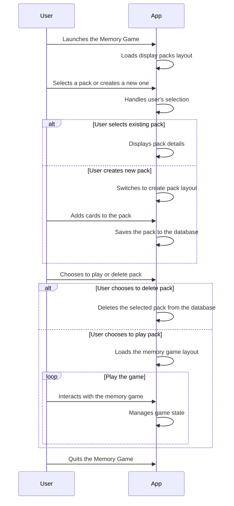

Here is a general description of the architecture

[Architecture](UML%20class.png)

Also a mermaid diagram:

```mermaid
sequenceDiagram
    participant User
    participant App

    User ->> App: Launches the Memory Game
    App ->> App: Loads display packs layout
    User ->> App: Selects a pack or creates a new one
    App ->> App: Handles user's selection
    alt User selects existing pack
        App ->> App: Displays pack details
    else User creates new pack
        App ->> App: Switches to create pack layout
        User ->> App: Adds cards to the pack
        App ->> App: Saves the pack to the database
    end
    User ->> App: Chooses to play or delete pack
    alt User chooses to delete pack
        App ->> App: Deletes the selected pack from the database
    else User chooses to play pack
        App ->> App: Loads the memory game layout
        loop Play the game
            User ->> App: Interacts with the memory game
            App ->> App: Manages game state
        end
    end
    User ->> App: Quits the Memory Game
```

